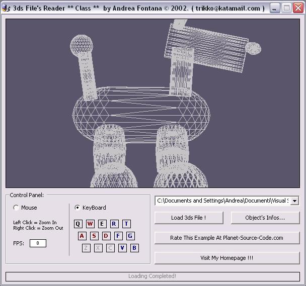

## New Vb class to read and render 3dstudio files without any dll or ocx\! Vb Pure\!

### Description

This is a 3ds (3ds Studio) file reader. It's pure vb code. It show the 3ds object without flips. I create a class (.cls) that you can insert in your app to read and render 3ds. You can move the object with mouse (dragging it) or keyboard. Look at the screenshot!
 
### More Info
 

             |
---                |---
**Submitted On**   |2002-08-01 12:09:44
**By**             |[A\. Fontana](https://github.com/Planet-Source-Code/PSCIndex/blob/master/ByAuthor/a-fontana.md)
**Level**          |Intermediate
**User Rating**    |4.8 (138 globes from 29 users)
**Compatibility**  |VB 6\.0
**Category**       |[Graphics](https://github.com/Planet-Source-Code/PSCIndex/blob/master/ByCategory/graphics__1-46.md)
**World**          |[Visual Basic](https://github.com/Planet-Source-Code/PSCIndex/blob/master/ByWorld/visual-basic.md)
**Archive File**   |[New\_Vb\_cla113168812002\.zip](https://github.com/Planet-Source-Code/a-fontana-new-vb-class-to-read-and-render-3dstudio-files-without-any-dll-or-ocx-vb-pure__1-37484/archive/master.zip)

